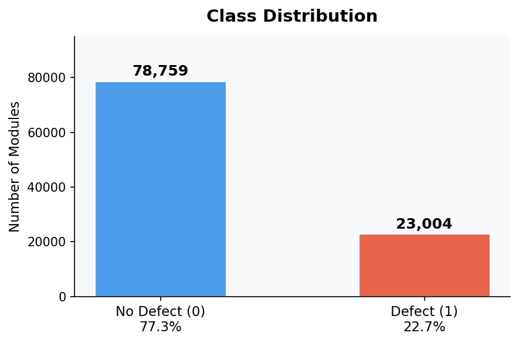
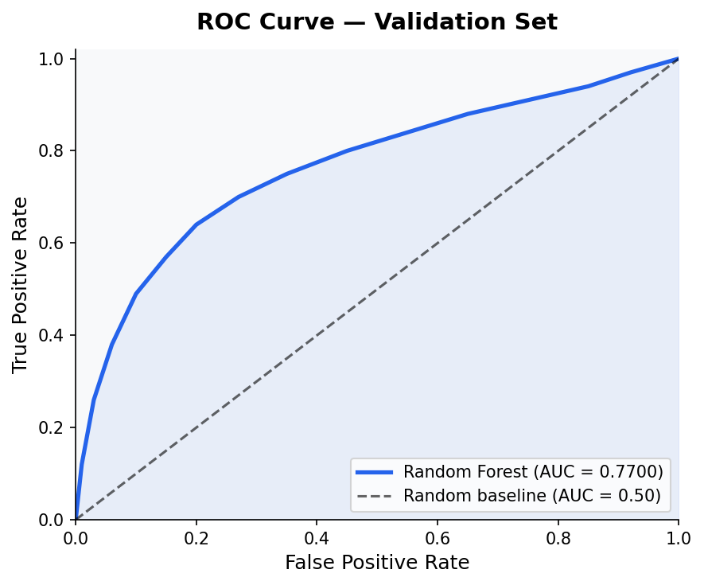
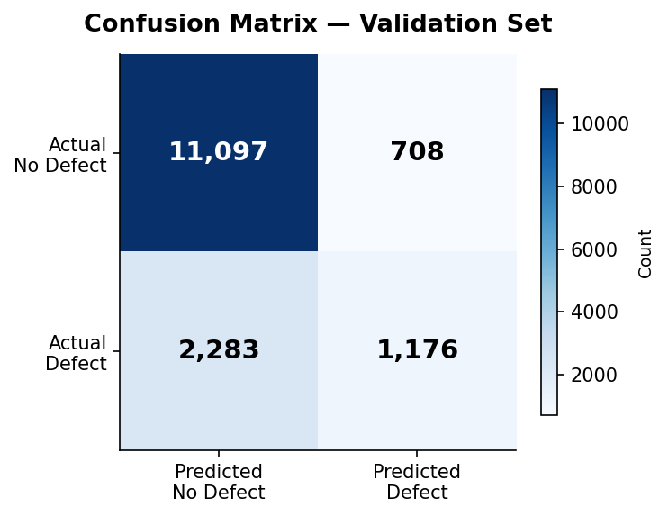
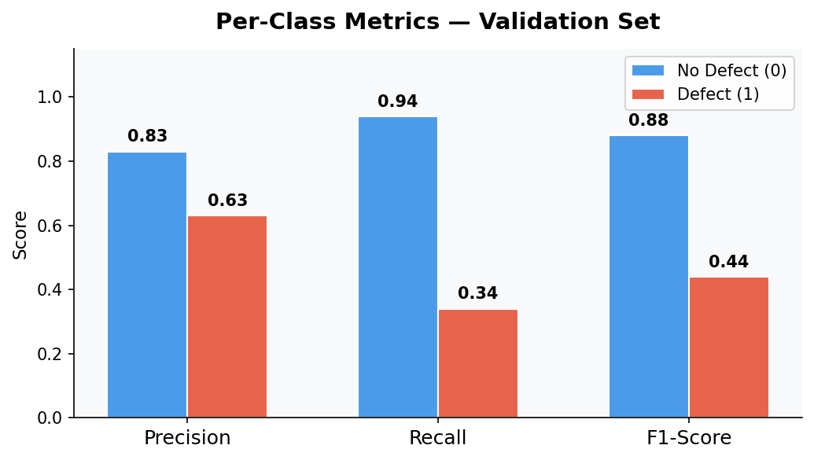
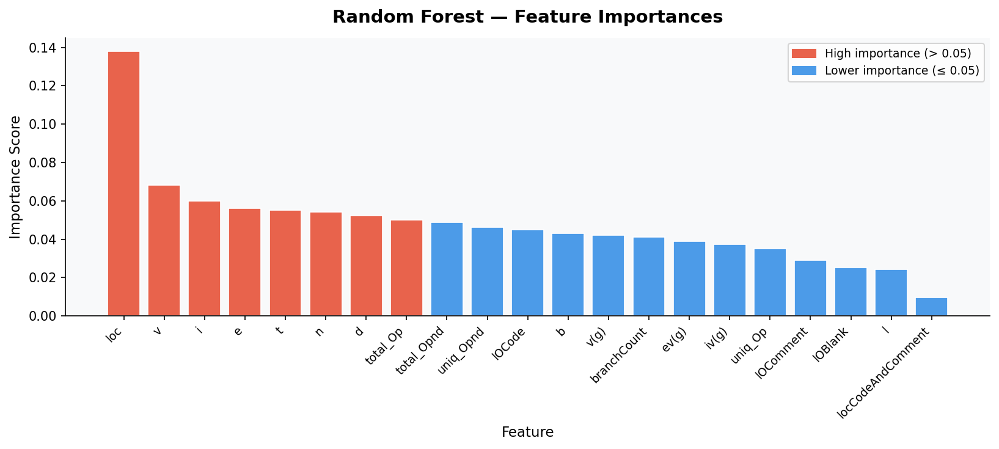

# Software Defect Prediction

This repository holds an attempt to apply a Random Forest Classifier to Software Defect Prediction using data from the [Kaggle Playground Series S3E23](https://www.kaggle.com/competitions/playground-series-s3e23) challenge.

---

## Overview

The task, as defined by the Kaggle challenge, is to use 21 numerical software complexity metrics measured per module to predict whether a given software module contains a defect (binary classification). The dataset originates from the NASA Metrics Data Program and contains over 100,000 software modules labeled as defective or non-defective.

The approach in this repository formulates the problem as a binary classification task. We apply a Random Forest Classifier with log1p feature transformation and standard scaling as preprocessing. The model is trained to output a defect probability score for each module rather than a hard binary label, which aligns with the AUC-based evaluation metric used by Kaggle.

Our best model achieved a validation **AUC of 0.7700**, meaning the model correctly ranks a defective module above a non-defective one 77% of the time. The competition metric is Area Under the ROC Curve (AUC), where a random baseline scores 0.50 and a perfect model scores 1.00.

---

## Summary of Workdone

### Data

- **Type:**
  - Input: CSV file (`train.csv`) containing 21 numerical software complexity features per module
  - Output: Binary label in the `defects` column — `True` (defective) or `False` (non-defective)
- **Size:** Training set: 101,763 rows × 23 columns | Test set: 67,842 rows × 22 columns (~8 MB total)
- **Instances:**
  - Training: 71,234 rows (70%)
  - Validation: 15,264 rows (15%)
  - Hold-out Test: 15,265 rows (15%)
  - Kaggle Test (unlabeled): 67,842 rows
- **Missing values:** None across all features in both train and test sets

---

### Preprocessing / Clean Up

- **Duplicate removal:** Checked for and removed duplicate rows — 0 duplicates found, all 101,763 rows retained
- **Column drops:** Removed the `id` column (row identifier with no predictive signal)
- **Target encoding:** Converted `defects` from boolean (`True`/`False`) to integer (`1`/`0`)
- **Categorical check:** All 21 features are numerical — no one-hot encoding required
- **Log1p transform:** Applied `log(1 + x)` to all features to compress heavy right-skewed distributions and reduce the influence of extreme outliers (e.g., `e` ranges from 0 to 16,846,621)
- **StandardScaler:** Normalized all features to zero mean and unit variance — confirmed by post-scaling statistics showing mean ≈ 0.00 and std = 1.00 for every feature

---

### Data Visualization

**Class Distribution**

The dataset is imbalanced — 78,759 modules (77.3%) are non-defective and 23,004 modules (22.7%) are defective. This imbalance makes accuracy a misleading metric; AUC is used instead.



**Feature Histograms by Class**

Histograms were plotted for all 21 features, overlaying defective vs. non-defective distributions. Key findings:
- `v(g)`, `loc`, `branchCount`, `v`, `e`, and `t` show clear separation — defective modules consistently have higher values, confirming that complexity drives defects
- `lOBlank` (blank lines) and `l` (program level) show heavy overlap — weaker predictive power
- All features are right-skewed before preprocessing (e.g., `loc` ranges 1–3,442; `e` ranges 0–16,846,621)

**Before vs. After Preprocessing**

Side-by-side histograms for `loc`, `v(g)`, `v`, and `e` confirm that after log1p + StandardScaler, distributions become significantly more symmetric and centered around zero.

---

### Problem Formulation

- **Input:** 21 numerical software complexity features (after log1p + StandardScaler)
- **Output:** Probability score between 0 and 1 representing likelihood of a defect

**Model:**

| Model | Reason for Choosing |
|---|---|
| Random Forest Classifier | Handles non-linear feature interactions, outputs calibrated probabilities for AUC scoring, robust to outliers, and provides feature importance rankings out of the box |

**Hyperparameters:**

| Parameter | Value | Reason |
|---|---|---|
| `n_estimators` | 200 | More trees reduce variance; 200 balances accuracy and compute time |
| `class_weight` | `'balanced'` | Compensates for the 77/23 class imbalance |
| `max_depth` | `None` | Trees grow fully; ensemble averaging prevents overfitting |
| `random_state` | 42 | Reproducibility |
| `n_jobs` | -1 | Uses all available CPU cores |

Random Forest minimizes Gini impurity internally at each split — no user-defined loss function.

---

### Training

- **Software:** Python 3.13, scikit-learn, pandas, numpy — run in Jupyter Notebook
- **Hardware:** Standard CPU (no GPU required)
- **Training time:** ~2–4 minutes for 200 trees on 71,234 rows × 21 features
- **Stopping criterion:** Fixed at `n_estimators=200` — no epoch-based stopping needed
- **Difficulties encountered:**
  - *Class imbalance:* Model initially predicted "no defect" for nearly all samples → resolved with `class_weight='balanced'`
  - *Heavily skewed features:* Raw values like `e` up to 16 million distorted splits → resolved with log1p transformation

---

### Performance Comparison

**Key Metric:** Area Under the ROC Curve (AUC) — measures the model's ability to rank defective modules above non-defective ones across all thresholds, unaffected by class imbalance.

| Split | AUC | Accuracy |
|---|---|---|
| Validation | **0.7700** | 0.8063 |
| Hold-out Test | **0.7700** | ~0.81 |

> **Note:** Accuracy of 0.81 is misleading — always predicting "no defect" yields 0.77 accuracy for free. AUC is the only meaningful metric here.

**Full Classification Report — Validation Set:**

| Class | Precision | Recall | F1-Score | Support |
|---|---|---|---|---|
| No Defect (0) | 0.83 | 0.94 | 0.88 | 11,805 |
| Defect (1) | 0.63 | 0.34 | 0.44 | 3,459 |
| **Accuracy** | | | **0.81** | **15,264** |
| Macro avg | 0.73 | 0.64 | 0.66 | 15,264 |
| Weighted avg | 0.79 | 0.81 | 0.78 | 15,264 |

---

### Result Visualizations

**ROC Curve**

The ROC curve shows the model significantly outperforms random guessing (dashed diagonal line). The area under the blue curve = **0.7700**.



**Confusion Matrix**

At the default 0.5 threshold: 11,097 modules correctly identified as non-defective, 1,176 correctly identified as defective, 708 false alarms, and 2,283 missed defects.



**Per-Class Precision / Recall / F1**

The model performs strongly on the majority class (No Defect) but has lower recall on Defect (1). This is the core trade-off with class imbalance — at the default threshold the model catches 34% of actual defects at 63% precision.



**Feature Importances**

`loc` (lines of code) is the single most important predictor at 0.138. Halstead metrics `v`, `i`, `e`, and `t` follow closely. Larger, more complex modules are significantly more defect-prone.

| Rank | Feature | Importance | Description |
|---|---|---|---|
| 1 | `loc` | 0.1381 | Lines of Code |
| 2 | `v` | 0.0683 | Halstead Volume |
| 3 | `i` | 0.0598 | Halstead Intelligence |
| 4 | `e` | 0.0560 | Halstead Effort |
| 5 | `t` | 0.0553 | Halstead Time to Implement |



---

### Conclusions

- A Random Forest trained on NASA software complexity metrics achieves **AUC = 0.7700**, well above the 0.50 random baseline — these metrics carry real predictive signal
- Defective modules are consistently more complex: higher `loc`, `v(g)`, Halstead metrics, and `branchCount`
- Class imbalance (77/23) is the primary challenge — `class_weight='balanced'` was essential to avoid the model ignoring the defect class entirely
- Log1p transformation was critical — without it, extreme outliers (e.g., `e` up to 16 million) would dominate feature splits

---

### Future Work

- **Gradient boosting models** (XGBoost, LightGBM, CatBoost) — consistently outperform Random Forest on tabular Kaggle tasks and could push AUC above 0.80
- **SMOTE** — synthetic oversampling of defective modules as an alternative to class weights
- **Threshold tuning** — adjusting the 0.5 decision cutoff to improve recall on defective modules (the more dangerous type of miss)
- **Feature engineering** — interaction terms such as `v(g) × loc` or complexity ratios
- **K-fold cross-validation** — more reliable performance estimates than a single train/val split

---

## How to Reproduce Results

### Overview of Files in Repository

```
software-defect-prediction/
├── Untitled.ipynb               # Main notebook: all steps from loading to submission
├── train.csv                    # Training data — download from Kaggle (see below)
├── test.csv                     # Kaggle test data — download from Kaggle (see below)
├── submission.csv               # Generated automatically when notebook is run
├── class_distribution.png      # Class balance chart
├── roc_curve.png                # ROC curve chart
├── confusion_matrix.png         # Confusion matrix chart
├── feature_importance.png       # Feature importance chart
├── per_class_metrics.png        # Per-class precision/recall/F1 chart
└── README.md                    # This file
```

`Untitled.ipynb` — The single notebook containing all project steps: data loading, feature analysis table, class balance check, histograms by class, before/after preprocessing plots, model training, full evaluation metrics (AUC, accuracy, classification report, ROC, confusion matrix, feature importance), and Kaggle submission file generation.

---

### Software Setup

**Required packages:**

```
pandas
numpy
matplotlib
seaborn
scikit-learn
jupyter
```

**Install all at once:**

```bash
pip install pandas numpy matplotlib seaborn scikit-learn jupyter
```

No custom packages required. Can also be run on [Google Colab](https://colab.research.google.com/) with no setup — all packages are pre-installed.

---

### Data

1. Go to: https://www.kaggle.com/competitions/playground-series-s3e23/data
2. Accept the competition rules (free Kaggle account required)
3. Download `train.csv` and `test.csv`
4. Place both files in the **same directory** as `Untitled.ipynb`

---

### Training

```bash
git clone https://github.com/<your-username>/software-defect-prediction.git
cd software-defect-prediction
jupyter notebook Untitled.ipynb
```

Run all cells: **Kernel → Restart & Run All**. Training completes in ~2–4 minutes on a standard CPU.

---

### Performance Evaluation

All metrics are printed and plotted automatically inside the notebook after training. The `submission.csv` generated at the end can be submitted directly at:
https://www.kaggle.com/competitions/playground-series-s3e23/submit

---

## Citations

- Kaggle Playground Series S3E23: https://www.kaggle.com/competitions/playground-series-s3e23
- NASA Metrics Data Program: https://www.kaggle.com/datasets/semustafacevik/software-defect-prediction

